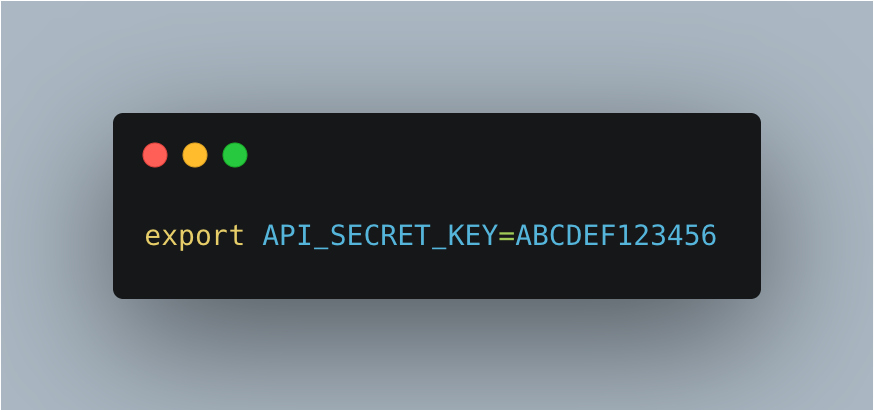

    

iOS Template

An enterprise iOS template application showcasing - App architecture pattern(MVVM-Coordinator-RxSwift), Testing stratergies, CI/CD pipeline using GitAction and fastlane, Localization, Code generation, Linting, Networking

### Requirements
* [Cocoapods](https://cocoapods.org/)
* [Fastlane](https://fastlane.tools/)
* [SwiftLint](https://github.com/realm/SwiftLint)
### Getting started
* Clone Repo
* Checkout `develop` brach
* Install pods using `pod install`

### MVVM-Coordinator-RxSwift Architecture
#### Resources
* [Coordinator pattern](https://hackingwithswift.com/articles/71/how-to-use-the-coordinator-pattern-in-ios-apps)
* [MVVM-Coordinator-RxSwift](https://medium.com/hackernoon/how-to-use-mvvm-coordinators-and-rxswift-7364370b7b95)
* [RxSwift](https://hackingwithswift.com/articles/71/how-to-use-the-coordinator-pattern-in-ios-apps)

This architecture is combination of best practices, which help to write code that is easier to read, reactive, testable and scalable.

### Code Tools
#### [Sourcery](https://github.com/krzysztofzablocki/Sourcery)
Sourcery is auto code genration tool that is used for storing the keys used in the application securely by generating them at build time. You'll have to manually add a shell script named `secrets-vars.sh` with below content, Make sure the file is in the root folder of the project along side `xcworkspace`.

you can find the script named `Generate SecretConfig.swift` in Build Phases of the main app target. Once built successfully you can find `SecretConfig.generated.swift` file generated under `Helpers` folder. *If not shown open the folder in finder window it will be there, just drag and drop it under Helpers folder*. This files will contain the secrets for usage in app. `secrets-vars.sh` and `SecretConfig.generated.swift` are both added to `.gitignore`.
#### [SwiftGen](https://github.com/SwiftGen/SwiftGen)
